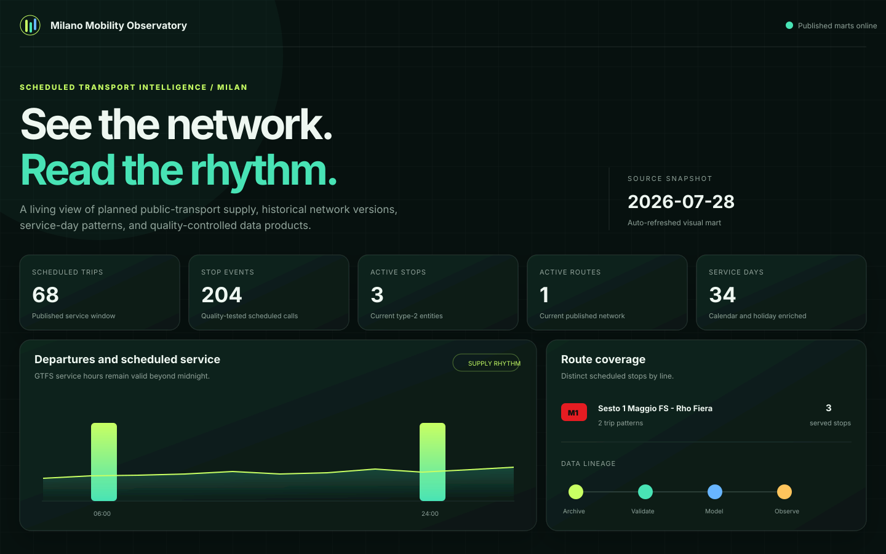
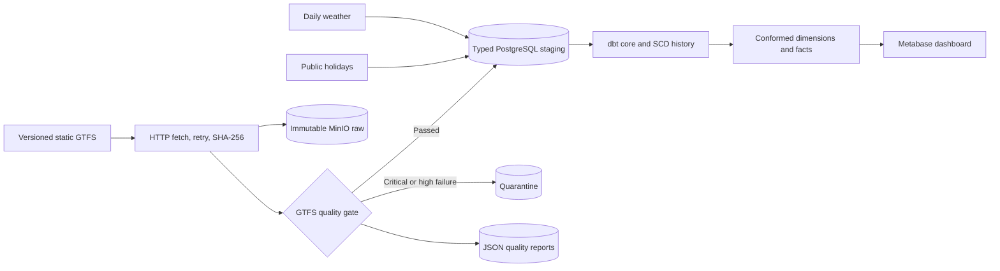

# Milano Mobility Data Platform

[](https://github.com/acilione/milano_mobility/actions/workflows/ci.yml)

A reproducible batch data platform for measuring Milan's **scheduled public-transport
supply**. It archives successive static GTFS feeds, rejects invalid snapshots, preserves
type-2 entity history, detects network changes, and publishes an analytics mart enriched
with calendar, holiday, and daily weather data.

The project deliberately does not claim to measure real-time punctuality or passenger
demand.



## Quick start

Requirements: Docker with Compose, an internet connection, at least 8 GB of available
memory, and 10 GB of free disk space. The same command works in Linux and macOS terminals
and in Windows PowerShell:

```bash
docker compose --profile demo run --build --rm demo
```

That single command builds the application, starts PostgreSQL and MinIO, downloads and
loads the complete official Comune di Milano/AMAT GTFS feed, executes every dbt model and
test, and prints a final `PUBLISHED` result with source row counts. No host Python, Make,
database, or `.env` file is required. On a typical laptop the first image build and full
load take several minutes; later image builds reuse the cache. Repeating an unchanged feed
prints `SKIPPED`, demonstrating idempotency.

The live source is [`https://dati.comune.milano.it/gtfs.zip`](https://dati.comune.milano.it/gtfs.zip),
published in the [Comune di Milano open-data catalogue](https://dati.comune.milano.it/en/dataset/ds929-orari-del-trasporto-pubblico-locale-nel-comune-di-milano-in-formato-gtfs)
from AMAT data under CC BY 4.0. Because this is the current official feed rather than a
checked-in sample, its checksum, row counts, and service window change when the publisher
releases a new version. Each downloaded ZIP is retained immutably in MinIO with its
SHA-256 digest and acquisition date. Small synthetic feeds in `tests/fixtures/` are used
only by automated tests.

The core services remain available after the command:

- Visual dashboard: <http://localhost:8501>
- MinIO console: <http://localhost:9001> (`minio` / `minio_dev_password`)
- PostgreSQL: `localhost:5432`, database `mobility`

The dashboard is configured automatically and reads the published marts through the
least-privilege `bi_reader` role. It includes network KPIs, service-volume trends, hourly
departures, route coverage, a stop constellation, entity-change summaries, and visual
data lineage. Route coverage and the stop map use every route and stop in the published
official snapshot. The browser interface has no third-party runtime dependencies; only
the first official-feed download requires network access.

To stop them without deleting the generated data, run `docker compose down`.

### Complete platform

To additionally start Airflow and Metabase:

```bash
docker compose up -d --build
```

Open:

- Airflow: <http://localhost:8080> (`admin` / `admin`)
- Visual dashboard: <http://localhost:8501>
- MinIO console: <http://localhost:9001> (`minio` / `minio_dev_password`)
- Metabase: <http://localhost:3000>
- PostgreSQL: `localhost:5432`, database `mobility`

At first Metabase launch, create its local administrator and connect the `mobility`
database using host `postgres`, user `bi_reader`, and password `bi_reader_dev` (or the
value configured in `.env`). Use the
versioned queries in [`dashboards/questions.sql`](dashboards/questions.sql) to create the
four supplied dashboard cards.

When a later official payload is published, run the same demo command again. Its new hash
creates the next snapshot and type-2 history. Then inspect the change events:

```bash
docker compose exec postgres psql -U postgres -d mobility -c \
  "select snapshot_date, entity_type, entity_id, change_type
   from marts.fact_network_change order by 1, 2, 3;"
```

## What happens to a feed



`snapshot_date` identifies the acquired network version. `service_date` identifies a day
on which a trip is scheduled to run. GTFS values such as `24:10:00` remain service-day
seconds (`87,000`) until the analytical layer needs a timestamp.

## Data products

- `marts.dim_stop` and `marts.dim_route`: deterministic type-2 history with validity
  intervals and current-row flags.
- `marts.dim_date`: conformed dates, weekdays, seasons, weekends, and Milan/Italian public
  holidays.
- `marts.dim_weather_day`: daily, area-level weather enrichment. Missing weather warns but
  does not block transport publication.
- `marts.fact_scheduled_trip`: one scheduled trip per source snapshot and service date.
- `marts.fact_stop_event`: one scheduled call per trip, service date, and stop sequence.
- `marts.dashboard_service_activity` and `marts.dashboard_stop_activity`: compact,
  pre-aggregated tables used by the visual dashboard and BI queries.
- `marts.fact_network_change`: added, removed, and modified stops, routes, and trips between
  consecutive snapshots.

Every Gold model exposes `loaded_at`, `pipeline_run_id`, `source_snapshot_date`, and
`dbt_invocation_id`. See the full [data dictionary](docs/data-dictionary.md).

## Quality and idempotency

The logical ingestion key is `source + sha256`. Replaying the same valid ZIP returns
`SKIPPED` without reloading staging or running dbt. Raw keys include both snapshot date and
SHA-256, and MinIO versioning is enabled for the raw bucket.

Blocking examples include missing GTFS files, duplicate logical keys, unresolved
trip-to-route references, invalid time syntax, or more than 0.5% invalid coordinates. The
previous marts remain available when a new snapshot is quarantined. Advisory issues and
row counts are written as JSON under `s3://curated/quality/`.

Run validation without infrastructure:

```bash
mobility validate --feed tests/fixtures/gtfs_v1.zip --snapshot-date 2026-07-31
```

## Development

```bash
make install
make quality
make quickstart
make integration
```

The quality target runs Ruff, formatting checks, strict mypy, unit tests, and coverage.
CI additionally builds the container and runs an ephemeral end-to-end load. Dependencies
are exact-pinned in lock files.

Useful operator commands:

```bash
make logs          # follow service logs
make dbt           # rebuild and test the warehouse
make docs          # generate dbt lineage documentation
make down          # preserve volumes
make reset         # intentionally delete local platform volumes and recreate them
```

The production DAG runs daily at 06:00 Europe/Rome with exponential retries for transient
HTTP/database errors and no automatic retry for validation failures. Manual parameters are
`snapshot_date`, `feed_url`, and `force_download`.

## Repository map

```text
ingestion/                 Typed Python fetch, hash, validate, store, and load package
orchestration/dags/        Airflow ingestion, quality, and backfill DAGs
transformations/dbt/       Staging, core, marts, seeds, tests, and lineage metadata
dashboards/                Versioned BI questions
tests/                     Unit, integration, and deterministic GTFS fixtures
infrastructure/postgres/   Roles, schemas, grants, and typed staging tables
infrastructure/terraform/  Cloud-ready AWS reference infrastructure
docs/                      Architecture, runbooks, ADR, dictionary, and test evidence
```

## Security

The checked-in values are isolated development defaults, allowing the demo to run with no
configuration. To override them, copy `.env.example` to `.env`; the real file is ignored.
Production deployments must use a secret manager, TLS endpoints, private networking,
rotated credentials, and external identity. Database access follows least privilege:
ingestion writes only audit/staging, dbt owns core/marts, and BI can only read marts.

## Trade-offs and improvements

- Static GTFS measures planned supply, not vehicle performance. GTFS-Realtime is a future,
  separately contracted source.
- PostgreSQL is enough for a portfolio-sized workload and keeps local setup approachable.
  Large `stop_times` histories would move to partitioned cloud storage and an elastic
  warehouse.
- Weather is optional by design, preventing an enrichment outage from hiding the transport
  schedule. Production weather backfills should retain provider payloads and licenses.
- Complete service-day-expanded facts remain queryable as views, while compact dashboard
  aggregates are materialized. This preserves full official-feed semantics without
  duplicating tens of millions of rows on every laptop. A multi-snapshot production
  warehouse should use incremental, date-partitioned facts.
- Airflow and Metabase make the architecture easy to inspect but require more laptop memory
  than a CLI-only demo.

See [ADR-001](docs/adr/001-local-first-postgres-minio.md) for the primary decision and the
[operations runbook](docs/runbooks/operations.md) for backfill and recovery procedures.
Portfolio evidence includes the [test report](docs/test-report.md) and a concise
[seven-minute demo script](docs/demo-script.md).
