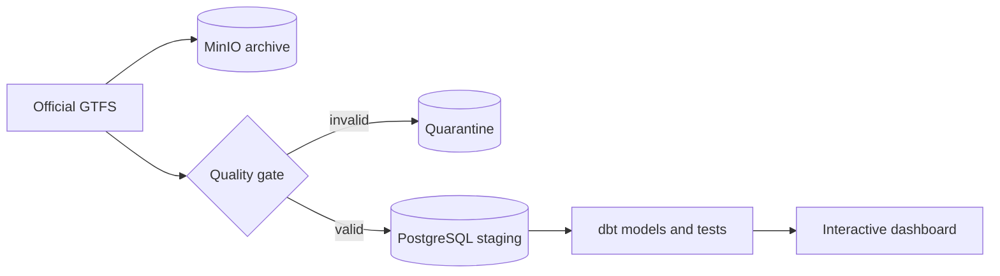

# Milano Mobility

[](https://github.com/acilione/milano_mobility/actions/workflows/ci.yml)

Milano Mobility is a small, local-first data platform built around Milan's official public
transport schedule. Its purpose is to turn a changing GTFS feed into something that is
easy to trust and explore: an immutable source archive, a tested analytical model, and a
visual view of the network.

The project measures planned service, not live vehicle positions, punctuality, or passenger
demand. It is meant as a complete and reproducible data-engineering example rather than a
mock dashboard backed by a few hand-written rows.

## How it works

Each run downloads the current GTFS archive, identifies it by SHA-256, and keeps the
original file in MinIO. A streaming quality gate checks the feed before PostgreSQL is
allowed to replace the current staging snapshot. dbt then builds network history,
service-day facts, and compact tables for the dashboard.



Two dates are kept deliberately separate: the snapshot date says when a network version
was acquired, while the service date says when a trip is scheduled to run. Loading a new
official version therefore adds history without rewriting what an older snapshot meant.

## Run it

You need Docker with Compose, an internet connection, about 8 GB of available memory, and
enough disk space for the full feed.

```bash
docker compose --profile demo run --build --rm demo
```

The command works in Linux and macOS terminals and in Windows PowerShell. It builds the
images, downloads the complete official feed, validates and models it, and leaves the
dashboard running at <http://localhost:8501>. Repeating the command with an unchanged feed
returns `SKIPPED` instead of loading the same payload twice.

The dashboard includes service volume, route coverage, network changes, and an interactive
stop map. Drag or zoom the map, then select a stop to see its scheduled calls and highlight
every route serving it.

Stop the services without deleting their data with:

```bash
docker compose down
```

## Configuration

The checked-in defaults are enough for the local demo. To change ports, credentials,
source metadata, schedules, service-area settings, or the optional weather provider, copy
`.env.example` to `.env` and edit only the values you need. `.env` is ignored by Git.

The default source is the [Comune di Milano open-data GTFS feed](https://dati.comune.milano.it/en/dataset/ds929-orari-del-trasporto-pubblico-locale-nel-comune-di-milano-in-formato-gtfs),
published from AMAT data under CC BY 4.0. Small generated feeds under `tests/fixtures` exist
only to keep automated tests fast and deterministic.

## Development

```bash
make install
make quality
make integration
```

The quality target runs Ruff, formatting checks, strict mypy, unit tests, and coverage.
Integration tests exercise PostgreSQL, MinIO, idempotency, quarantine behavior, dbt, and
the read-only dashboard API.

The main directories follow the data flow:

```text
ingestion/             Fetching, validation, storage, loading, and the dashboard server
orchestration/dags/    Airflow schedules and backfills
transformations/dbt/   Staging, history, facts, aggregates, and data tests
infrastructure/        Local PostgreSQL setup and cloud reference infrastructure
dashboards/            Reusable analytical queries
docs/                  Decisions, operations notes, and test evidence
```

More detail is available in the [data dictionary](docs/data-dictionary.md),
[architecture decision](docs/adr/001-local-first-postgres-minio.md), and
[operations runbook](docs/runbooks/operations.md).
