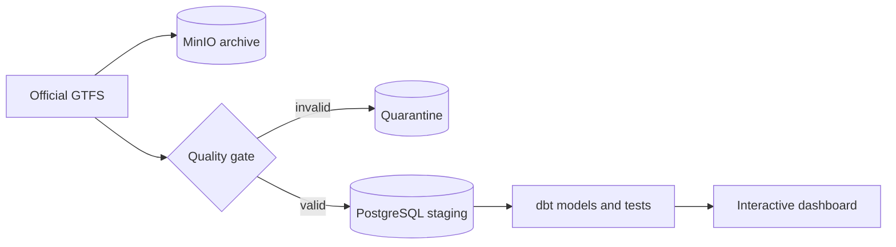

# Milano Mobility

[](https://github.com/acilione/milano_mobility/actions/workflows/ci.yml)

Milano Mobility helps you explore where you could live within a chosen commute of your
workplace or university, using Milan's official public transport timetable. Choose a
destination on the map or search for a stop, pick a travel date and arrival time, and
compare areas within 15, 30, 45 or 60 minutes. Select a reachable stop to inspect its
scheduled journey. Destination and travel preferences can be saved in your browser.

The commute map uses scheduled services, up to two transfers, a two-minute transfer
allowance, and estimated walking links. Walking uses 4.5 km/h and a 30% distance allowance,
with a selectable 5, 10 or 15 minute limit per walking leg. Shading uses 100 m cells and
is an approximate walking catchment, not a street-routed isochrone: barriers, station entrances and
accessibility are not modeled. Live positions, delays and cancellations are not included.
Service dates are limited to the published timetable; historical dates are labeled.

Behind the map is a reproducible local-first data platform: an immutable source archive,
a tested analytical model, and network analytics available below the commute explorer.

## How it works

Each run downloads the current GTFS archive, identifies it by SHA-256, and keeps the
original file in MinIO. A streaming quality gate checks the feed before PostgreSQL is
allowed to replace the current staging snapshot. dbt then builds network history,
service-day facts, and compact tables for the dashboard.



Two dates are kept deliberately separate: the snapshot date says when a network version
was acquired, while the service date says when a trip is scheduled to run. Loading a new
official version therefore adds history without rewriting what an older snapshot meant.

## Run it

You need Docker with Compose, an internet connection, about 8 GB of available memory, and
enough disk space for the full feed.

```bash
docker compose --profile demo run --build --rm demo
```

The command works in Linux and macOS terminals and in Windows PowerShell. It builds the
images, downloads the complete official feed, validates and models it, and leaves the
dashboard running at <http://localhost:8501>. Repeating the command with an unchanged feed
returns `SKIPPED` instead of loading the same payload twice.

The dashboard includes service volume, route coverage, network changes, and an interactive
MapLibre stop map. Stops are clustered for smooth navigation; select one to see its
scheduled calls and draw every official GTFS route shape serving it. The TypeScript map is
compiled inside the Docker image, so running the project does not require Node.js locally.
Use **Update data** in the dashboard to check the official source. Matching HTTP metadata
ends the check immediately without downloading the archive; a newer version starts a full
feed download that can be cancelled from the same button. Progress is shown in the header
while the last published snapshot remains available, and new data only appears after
validation and dbt tests finish successfully.

For an existing installation, build the new commute tables once, then rebuild the app:

```bash
docker compose run --rm --entrypoint dbt pipeline build --select commute_connections commute_service commute_stops --project-dir /workspace/transformations/dbt --profiles-dir /workspace/transformations/dbt
docker compose up -d --build frontend
```

The commute API (`GET /api/commute`) accepts `lat`, `lon`, `date` (YYYY-MM-DD),
`time` (HH:MM, Europe/Rome), `minutes` (15/30/45/60), and `walk` (5/10/15).
It computes latest departures using reverse connection scans, including prior service
days' after-midnight trips and calendar exceptions. It excludes boarding/alighting that
requires arrangements or is prohibited. Adjacent connections are materialized once per
source trip; they are joined to service dates only for the requested travel window.
An in-memory cache holds up to eight timetable windows keyed by published pipeline run.
Routing reads through the BI account with a 30-second database statement timeout.

Stop the services without deleting their data with:

```bash
docker compose down
```

## Configuration

The checked-in defaults are enough for the local demo. To change ports, credentials,
source metadata, schedules, service-area settings, or the optional weather provider, copy
`.env.example` to `.env` and edit only the values you need. `.env` is ignored by Git.

The default source is the [Comune di Milano open-data GTFS feed](https://dati.comune.milano.it/en/dataset/ds929-orari-del-trasporto-pubblico-locale-nel-comune-di-milano-in-formato-gtfs),
published from AMAT data under CC BY 4.0. Small generated feeds under `tests/fixtures` exist
only to keep automated tests fast and deterministic.

## Development

```bash
make install
make quality
make integration
```

The quality target runs Ruff, formatting checks, strict mypy, unit tests, and coverage.
Integration tests exercise PostgreSQL, MinIO, idempotency, quarantine behavior, dbt, and
the read-only dashboard API.

The main directories follow the data flow:

```text
ingestion/             Fetching, validation, storage, loading, and the dashboard server
frontend/              TypeScript MapLibre renderer and its pinned build configuration
orchestration/dags/    Airflow schedules and backfills
transformations/dbt/   Staging, history, facts, aggregates, and data tests
infrastructure/        Local PostgreSQL setup and cloud reference infrastructure
dashboards/            Reusable analytical queries
docs/                  Decisions, operations notes, and test evidence
```

More detail is available in the [data dictionary](docs/data-dictionary.md),
[architecture decision](docs/adr/001-local-first-postgres-minio.md), and
[operations runbook](docs/runbooks/operations.md).
