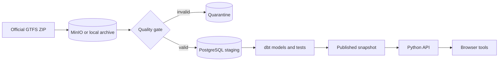

# Milano Mobility

[](https://github.com/acilione/milano_mobility/actions/workflows/ci.yml)

Compare Milan addresses by nearby services and scheduled travel. Add up to three
addresses, tick those to include, and reuse them across the nearby-place and journey
tools. Transit results use the published timetable: live vehicle positions, delays and
cancellations are not available.

## Using the tools

| Tool | What to enter | What you can inspect |
| --- | --- | --- |
| **Compare nearby places** | Addresses, categories, radius and walking limit | A category-by-address table. Select a cell for places, source details and walking routes. |
| **Compare journeys** | A common destination, addresses, travel days and arrival/return times | Travel, walking and transfers. Open **Daily journeys & routes**, select a date, then **Show route map**. |
| **Explore commute areas** | Destination, service date, arrival time and travel/walking limits | Approximate reachable areas and a searchable stop list. Select a stop for its journey and route map. |
| **Transport network** | A stop search or map selection | Connected routes, scheduled calls, service calendar, hourly departures and network changes. **Show all routes** clears the stop selection. |

On smaller screens, the settings buttons reveal each tool's controls. Route and source
details open in windows within the tool. Map clicks move a destination only after you
enable the placement action.

## How each feature is implemented

### Milan address autocomplete

After at least three characters and a 600 ms typing pause, the browser calls
`GET /api/places?q=...`. The server queries **Photon**, an OpenStreetMap geocoder,
with a Milan bounding box and centre bias. It filters results to Milan, deduplicates
labels and returns up to five suggestions. Arrow keys and Enter select a result;
Escape closes suggestions. **Search** performs an immediate lookup.

Code: [autocomplete.ts](frontend/src/autocomplete.ts),
[places.py](ingestion/milano_mobility/places.py).

### Nearby places and category comparison

`POST /api/nearby` queries **Overpass** for OpenStreetMap nodes, ways and relations
within 500, 1,000 or 1,500 metres of each address. Categories cover cafés, supermarkets,
cinemas, bookshops, libraries, pharmacies, restaurants, parks, post offices, banks,
medical care and gyms.

Discovery, classification and the interface share
[category_rules.json](ingestion/milano_mobility/category_rules.json). Each category
requires explicit service tags. Names and brands do not determine categories;
ambiguous types and records explicitly marked inactive or private/no-access are
excluded. Multiple categories require independent evidence. **Categories & data**
explains the rules; place details show the recorded type and restrictions.

For each address/category, the server checks the nearest **20 mapped candidates by
straight-line distance** using the pedestrian **OSRM Table API**. The table reports
how many checked places fall within a 5/10/15/20-minute walk and the shortest checked
walking time. It distinguishes mapped, checked, reachable and unknown-route counts.
Shortest walks are highlighted only when all compared addresses have complete checks
and uncapped shortlists. Address and already-loaded category toggles update results
locally; a new category requires another comparison.

Results are bounded shortlists, not exhaustive business counts. Strict classification
can omit incompletely tagged places, and source records can still be wrong. Recorded
opening hours are displayed without a live open/closed check. Nearby reachability
uses walking only.

Code: [nearby.ts](frontend/src/nearby.ts), [nearby.py](ingestion/milano_mobility/nearby.py),
[category_rules.py](ingestion/milano_mobility/category_rules.py).

### Walking directions and route windows

`POST /api/walking-route` calls the pedestrian **OSRM Route API** for a path, duration,
distance and turn instructions. **MapLibre GL** draws the GeoJSON in the place's detail
window. MapLibre renders the map; OSRM calculates the walking route.

Walking calculations include short links from coordinates to the routed street at
4.5 km/h. Snaps beyond 100 metres are rejected; unavailable routes remain unknown.
Building centres can differ from entrances, and accessibility is not verified.

`POST /api/journey-map` combines pedestrian routes with official **GTFS shapes** matched
to each transit trip and its ordered stops. Missing transit geometry appears as dashed
stop-to-stop links. Estimated access links and missing walking geometry are identified
separately. Displaying a map does not revise calculated timetable or transfer times.

Code: [route-view.ts](frontend/src/route-view.ts),
[route_maps.py](ingestion/milano_mobility/route_maps.py).

### Scheduled journey comparison

`POST /api/comparison` reads the locally published **GTFS timetable in PostgreSQL**.
The dbt models `commute_connections`, `commute_service` and `commute_stops` prepare
routing data. There is no external transit-directions API.

The server shortlists up to twelve nearby boarding stops per location and uses the
**OSRM Table API** for street walking between addresses, stops and the destination.
Connection scans find morning journeys arriving by the requested time and return
journeys leaving at the requested time, within a 90-minute window each way. Routing
allows up to two transfers with a two-minute transfer allowance. Transfer walks remain
estimates. A return ten minutes later is also calculated for comparison.

The algorithm handles calendar exceptions, previous service days' after-midnight trips
and boarding/alighting restrictions. Times use Europe/Rome. Weekly totals are withheld
if any selected date or round trip is unavailable. The interface shows timetable
coverage and expiry. Overnight work shifts across dates are unsupported.

Code: [comparison.ts](frontend/src/comparison.ts),
[comparison.py](ingestion/milano_mobility/comparison.py),
[commute.py](ingestion/milano_mobility/commute.py),
[dbt marts](transformations/dbt/models/marts).

### Commute area map

`GET /api/commute` accepts a destination (`lat`, `lon`), `date`, arrival `time`, total
`minutes` (15/30/45/60) and per-leg `walk` limit (5/10/15). A reverse connection scan
of the local GTFS tables finds the latest departures from reachable stops.

Area calculations use **estimated geometric walking links** at 4.5 km/h with a 30%
distance allowance. Shading uses 100-metre cells; it is not a street-routed isochrone
and does not model barriers, entrances or accessibility. Calculating the area needs no
external routing request. Opening a stop's route window subsequently uses the
journey-map endpoint. Stop search uses local GTFS stop names.

Code: [commute.ts](frontend/src/commute.ts), [commute.py](ingestion/milano_mobility/commute.py).

### Transport network and base maps

`GET /api/dashboard` reads **dbt/PostgreSQL aggregates** for service volume, stop calls,
route coverage, service dates, departures by service hour and changes between imported
network snapshots. `GET /api/route-shapes?route_sk=...` loads official GTFS shapes.
Stops are clustered in the browser; selecting one filters its connected routes.

All maps use **MapLibre GL** with raster tiles requested directly by the browser from
**OpenStreetMap**. Tiles supply map context, not schedules or routing calculations.

Code: [map.ts](frontend/src/map.ts), [index.html](ingestion/milano_mobility/static/index.html),
[web.py](ingestion/milano_mobility/web.py).

### Saved addresses, comparison links and CSV

Shared addresses and saved travel settings use browser **localStorage**. Comparison
links encode locations and the schedule in the URL fragment; calculated results are
not included and must be refreshed. Recipients need access to the same application;
a localhost link is only usable on its host machine. Journey CSV exports are generated
in the browser. No external API or user account is used. Older saved address lists and
comparison links remain supported.

Code: [addresses.ts](frontend/src/addresses.ts), [comparison.ts](frontend/src/comparison.ts).

### Timetable updates

**Update data** calls `POST /api/refresh`; `GET /api/refresh` returns progress. Matching
source HTTP metadata avoids downloading again. Otherwise the pipeline downloads the
**Comune di Milano / AMAT GTFS ZIP**, identifies it by SHA-256 and archives it in
**MinIO** or an optional local directory. Identical payloads are skipped. Validation
quarantines invalid feeds; successful loads build and test dbt models before publication.
The last published snapshot stays available during processing. Cancellation uses
`POST /api/refresh/cancel`.

The server checks every 24 hours while running, with the first automatic check after
that interval. Set `DASHBOARD_AUTO_UPDATE_HOURS=0` when Airflow handles updates.


```mermaid
flowchart LR
    Source[Official GTFS ZIP] --> Archive[(MinIO or local archive)]
    Archive --> Validate{Quality gate}
    Validate -->|invalid| Quarantine[(Quarantine)]
    Validate -->|valid| Stage[(PostgreSQL staging)]
    Stage --> Model[dbt models and tests]
    Model --> Publish[Published snapshot]
    Publish --> API[Python API]
    API --> UI[Browser tools]
```

`snapshot_date` identifies the acquired network version; `service_date` is when a trip
runs. New snapshots add network history. Routing uses the read-only BI account with a
30-second statement timeout and caches up to eight timetable windows keyed by published run.

Code: [pipeline.py](ingestion/milano_mobility/pipeline.py),
[web.py](ingestion/milano_mobility/web.py).

## External services and configuration

| Data or API | Default endpoint | Configuration | Information sent |
| --- | --- | --- | --- |
| Official GTFS | `https://dati.comune.milano.it/gtfs.zip` | `GTFS_SOURCE_URL` | Feed request; no user addresses |
| Photon | `https://photon.komoot.io/api/` | `GEOCODER_URL` | Typed search text and Milan bounds |
| Overpass | `https://overpass-api.de/api/interpreter` | `OVERPASS_URL` | Address coordinates, radius and service-tag queries |
| OSRM pedestrian routing | `https://routing.openstreetmap.de/routed-foot`, then `/table/v1/foot/...` or `/route/v1/foot/...` | `WALK_ROUTER_URL` | Coordinates of locations, stops and places |
| OpenStreetMap tiles | `https://tile.openstreetmap.org/{z}/{x}/{y}.png` | `MAP_STYLE` in `frontend/src/map.ts` | Visible map tile requests from the browser |
| Open-Meteo historical weather (optional analytics) | `https://archive-api.open-meteo.com/v1/archive` | `WEATHER_API_URL` | Service-area coordinates and date range |

The default integrations require no API keys. Search and routing calls go through the
Python server and are cached, with at least 1.1 seconds between requests to each of
those services. Overpass requests are serialized and cached by address/radius/UTC day.
No background city-wide scraping is performed. Provider calls require internet access
even with a locally loaded timetable.

For public traffic, configure dedicated services under the
[Photon usage policy](https://github.com/komoot/photon#demo-server),
[FOSSGIS service policy](https://routing.openstreetmap.de/about.html) and
[Overpass resource guidance](https://dev.overpass-api.de/overpass-doc/en/preface/commons.html).
The public endpoints are shared services with usage limits.

Copy [.env.example](.env.example) to `.env` to change providers, ports, credentials,
source metadata or schedules. `.env` is ignored by Git. The official feed's source and
licence metadata are configured as Comune di Milano / AMAT, CC BY 4.0; see the
[dataset listing](https://dati.comune.milano.it/en/dataset/ds929-orari-del-trasporto-pubblico-locale-nel-comune-di-milano-in-formato-gtfs).

Optional Airflow schedules ingestion, quality checks and weather backfills. Metabase and
[analytical queries](dashboards/questions.sql) support warehouse exploration. Open-Meteo
weather enrichment does not affect journeys or nearby-place rankings. Terraform in
`infrastructure/` is reference infrastructure, not required for the local planner.

## Run locally

You need Docker with Compose, internet access, about 8 GB of available memory and disk
space for the full feed. From Linux, macOS or Windows PowerShell:

```bash
docker compose --profile demo run --build --rm demo
```

This builds the app, imports the official timetable and leaves the dashboard at
<http://localhost:8501>. An unchanged feed returns `SKIPPED`. Docker compiles the
TypeScript frontend, so Node.js is not needed on the host.

For an existing installation missing the commute tables, build them before restarting:

```bash
docker compose run --rm --entrypoint dbt pipeline build --select commute_connections commute_service commute_stops commute_trip_shapes --project-dir /workspace/transformations/dbt --profiles-dir /workspace/transformations/dbt
docker compose up -d --build frontend
```

Stop services without deleting their data:

```bash
docker compose down
```

For a native Python installation, `LOCAL_ARCHIVE_DIRECTORY` selects a persistent
filesystem archive instead of S3/MinIO, retaining raw files and quality/quarantine
reports. PostgreSQL and dbt are still required. The standard Compose demo retains its
MinIO dependencies; setting this variable alone does not remove them.

## Development

Python checks (Linux/macOS or WSL):

```bash
make install
make quality
make integration
```

`make quality` runs Ruff, formatting checks, strict mypy, unit tests and coverage.
Integration tests require the running Compose stack and exercise PostgreSQL, MinIO,
idempotency, quarantine, dbt and the read-only API. The optional live routing check needs
a preloaded official timetable:
`TEST_LIVE_FEED=1 pytest tests/integration/test_commute_live.py`.

Frontend checks and build, using Node.js (the Docker build uses Node 22):

```bash
cd frontend
npm ci
npm run typecheck
npm run build
```

For a native server, copy `frontend/dist/` into `ingestion/milano_mobility/static/dist/`.
Docker performs that copy during its build. Generated feeds in `tests/fixtures` keep
tests deterministic; they are not the application's default timetable.

| Directory | Purpose |
| --- | --- |
| `ingestion/` | Downloading, validation, storage, routing and the Python HTTP server |
| `frontend/` | TypeScript tools, MapLibre maps and pinned build configuration |
| `transformations/dbt/` | Staging, network history, facts, routing tables and data tests |
| `orchestration/dags/` | Optional Airflow schedules and backfills |
| `infrastructure/` | Local PostgreSQL setup and cloud reference infrastructure |
| `docs/` | Architecture decisions, operations and test evidence |

See the [data dictionary](docs/data-dictionary.md),
[architecture decision](docs/adr/001-local-first-postgres-minio.md) and
[operations runbook](docs/runbooks/operations.md) for further detail.
