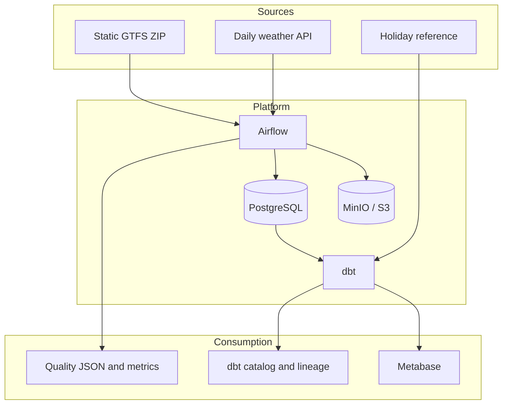

# Architecture

The platform applies a medallion-style flow without tying storage interfaces to one cloud.

## Logical boundaries

- **Raw:** immutable source ZIP, manifest JSON, and HTTP metadata in S3-compatible storage.
- **Staging:** a typed, one-to-one relational representation keyed by snapshot and run.
- **Core:** calendar expansion and deterministic source-date SCD history.
- **Marts:** conformed dimensions and scheduled-trip, stop-event, and network-change facts.

Airflow owns scheduling, retry, and state transitions. Python owns source contracts,
validation, object storage, and bulk loading. dbt owns relational business semantics,
lineage, documentation, and publication tests.

The raw archive is the recovery source. Core and marts are reproducible from accepted raw
objects and version-controlled transformation code.
